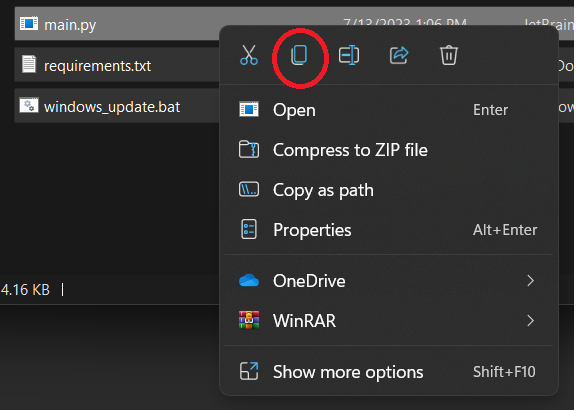

# Auto Update Minecraft Bedrock Server
Scripts for Automatically updating a Minecraft Bedrock edition Server.

## Requirements:
- Python 3
- Installed Minecraft Server

# Windows Usage:

## Install (Bedrock):

1a. Clone the repo into any folder:

```$ git clone https://github.com/vn536zl/auto-server-update.git```

1b. Or install the zip file from GitHub and extract it:


2. Copy the files Into the directory with your Bedrock Server folder:




